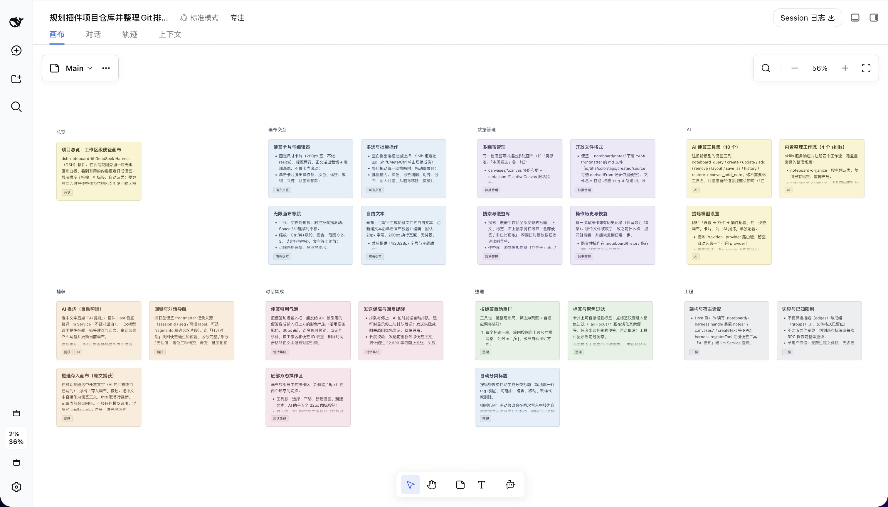
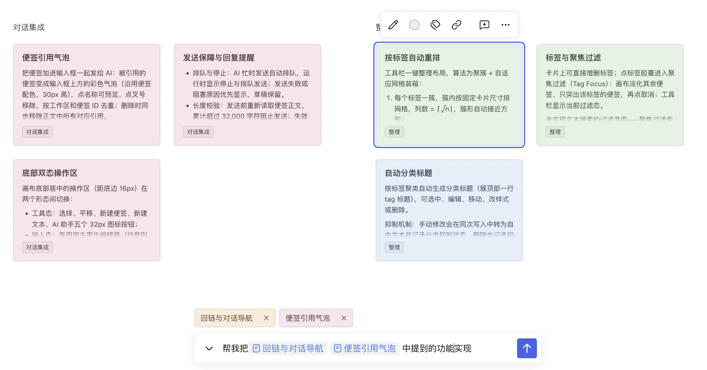
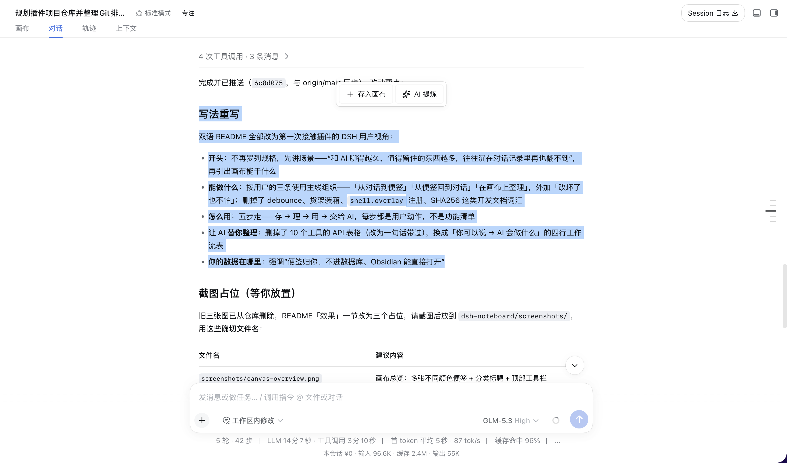
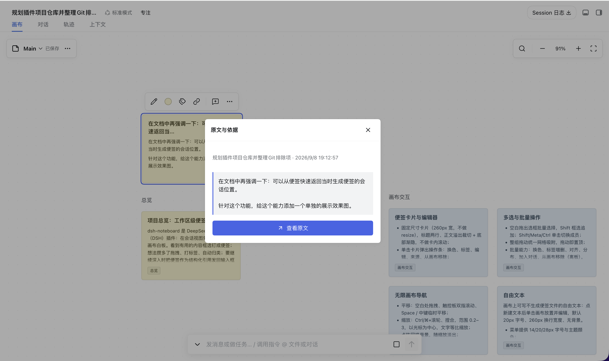

<h1 align="center">dsh-noteboard</h1>

<p align="center"><a href="README.md">中文</a> | English</p>

<p align="center">
  A noteboard canvas plugin for DeepSeek Harness (DSH): a workspace-wide infinite canvas presented as a tab in the conversation view. Notes are Markdown files and canvases are JSON Canvas layout files; content and placement are separated and manageable with any text editor or Git. Text can be captured from conversations into notes, and notes can be sent back to the composer as structured citations for the model.
</p>

<p align="center">
  
  
  
</p>

## Screenshots 📸

**Canvas overview**



**Citing notes into the composer**



**Capturing a note from a conversation**



**Jumping from a note back to its source**



<!-- Put screenshots in the screenshots/ directory:
     - canvas-overview.png — canvas overview: notes in several colors + category headings + the top toolbar
     - cite-notes.png — input state: bottom composer expanded with 2–3 note citation bubbles above it
     - capture-from-chat.png — a text selection in the conversation view with the "save to canvas / AI distill" popover
     - backlink-jump.png — the conversation view after clicking a note's "source / open conversation", with the origin text highlighted -->

## Features ✨

- **Infinite canvas** — pan, zoom, marquee group-move, grid snapping, plus free text and tag-clustered headings; the same notes can live on multiple canvas layouts, switchable anytime
- **Markdown notes** — each note is a `.md` file with frontmatter; live-preview editor, seven colors, light and dark themes
- **Capture from conversations** — select text to "save to canvas" verbatim or "AI distill" it into a note
- **Source backlinks** — every captured note remembers which session and passage it came from; "open conversation" jumps straight to the highlighted origin, and one click returns to the canvas
- **Send back to the AI** — notes join the composer as citation bubbles and go out as structured citations; sending is blocked beyond 32,000 cumulative characters
- **Organizing** — tag-pill focus filter, auto-rearrange by tag (backed up, restorable), search across titles / bodies / tags, off-board note library
- **AI tools** — 12 tools and 5 bundled workflows support reading conversation ranges, extracting, querying, modifying, organizing, and synthesizing notes (tables below)
- **History & restore** — every write shows a before/after diff and is restorable; conflicting restores are refused

## AI Tools & Workflows 🤖

12 model tools registered with the plugin:

| Tool | Description |
| --- | --- |
| `canvas_add_note` | Create a note and place it on a canvas; optionally record `derivedFrom` provenance |
| `noteboard_query` | Search workspace notes, or read full content, versions, and sources by ids |
| `noteboard_create` | Batch-create up to 200 notes with shared or per-note sources and optional exact deduplication |
| `noteboard_sessions` | Find source sessions in the current workspace by title or ID, with paginated metadata |
| `noteboard_read_session` | Read current or specified conversation text by sequence, time, and role, including long-message continuation |
| `noteboard_update` | Modify notes with read-time versions; batch by color for classification. Content and color edits affect every canvas |
| `noteboard_add` | Place existing notes onto a canvas without copying files |
| `noteboard_remove` | Remove notes from a canvas only; files are kept |
| `noteboard_layout` | Group by tag, arrange in explicit ID order, align, or distribute notes (must carry the canvas version) |
| `noteboard_save_as` | Save the canvas layout under a new name |
| `noteboard_history` | List operations; inspect before/after file content |
| `noteboard_restore` | Restore an operation, refusing to overwrite later changes |

Plus 5 bundled workflows (skills):

| Workflow | Description |
| --- | --- |
| `noteboard-extract` | Filter conversations, selected ranges, files, or referenced material into notes with source metadata |
| `noteboard-organize` | Group and tag notes, color by content, or arrange by version, time, or priority |
| `noteboard-compare` | Compare plans captured in notes; weigh trade-offs and spot disagreements |
| `noteboard-actions` | Break ideas in notes down into action items or implementation steps |
| `noteboard-synthesize` | Merge duplicate notes, deduplicate, or synthesize conclusions |

Regular operations use the session model; the "AI distill" model is configured separately in plugin settings.

For example: "Color these release notes by the kind of change, then arrange them in ascending version order, four per row." The model reads the notes, chooses the color mapping and version order, updates notes in color groups, reads the latest canvas version, then calls `noteboard_layout` with `action: "ordered"`, sorted `ids`, and `columns: 4`. The tool preserves that order from left to right, row by row, keeps tags and dimensions, and avoids unselected canvas objects. Use `columns: 1` for a vertical timeline; omit it for a roughly square grid. The model determines version order; the layout tool does not parse versions. `rearrange` continues to group by the first tag. Layout operations can be restored through history.

### Extract Notes by Criteria

For example: "Save confirmed product decisions from this conversation as notes, excluding tentative proposals," or "Extract unresolved questions from this afternoon in the specified conversation, one per note; show a preview first." `noteboard-extract` follows the requested scope and format. Preview requests produce drafts only; save requests check existing notes before creating new ones.

- `noteboard_sessions` searches session titles and IDs within the current workspace. A source in another workspace requires a user-specified session ID; created notes still belong to the executing session's workspace.
- `noteboard_read_session` defaults to the current session. `fromSeq/toSeq` are inclusive event sequences, not conversation turn numbers; `fromTime/toTime` are inclusive Unix milliseconds. `roles` selects `user`, `assistant`, or both.
- The tool reads original conversation text, including pre-compaction messages. It excludes reasoning, tool output, and injected context, and does not parse images or attachments. `nonTextBlocks` indicates non-text material in the selected range.
- Pages default to 40 messages and 12,000 characters. Pass the entire `next` object into the next call until `complete: true`. Continuations retain the initial capture boundary; later messages require a new read. Long messages expose `start/end` offsets so their text can be joined by `seq`.
- The existing `source` field stores conversation `sessionId/seq/label/text`, file `path/startLine/endLine/label/text`, or web `url/label/text`. Batch sources provide defaults that individual notes may override. Cite multiple sources in the body and record the primary source in `source`. Existing conversation navigation remains available; file and web references are stored as metadata.
- Optional `deduplicate: true` skips notes with matching titles and bodies, ignoring surrounding whitespace, within the target canvas and the current batch. `skipped` reports input indices and existing IDs without modifying those notes. It defaults to false. The workflow handles semantic duplicates by reading existing content and checks persisted results before retrying.

Historical discovery and reads use the host's `sessionQuery` service; the current conversation can be read directly from the executing Session. Missing services produce explicit errors. File and web content use existing host read tools.

## Install 📦

Requires the `dsh` CLI (`>= 0.1.2-rc.1`) and Node `>= 22.19.0`.

**From npm (recommended)**

```sh
dsh plugin --profile web add dsh-noteboard
dsh web
```

The npm package ships **prebuilt artifacts** — no build scripts run on your machine and no pnpm build authorization is needed.

> If `add` doesn't pick up the latest version: that's pnpm's `minimumReleaseAge` safety mechanism — for **24 hours** by default, freshly published versions aren't resolved as `latest` and fall back to the previous stable one. To get the newest release immediately, pin the version:
>
> ```sh
> dsh plugin --profile web add dsh-noteboard@<version>
> ```

**From GitHub source**

```sh
dsh plugin --profile web add github:boogoo619/dsh-noteboard
dsh web
```

> Installing from git pulls the **source** and builds it on the spot via the `prepare` script. pnpm ≥10 refuses to run `prepare` at first; after the initial `add` fails, copy the package key into that profile's `pnpm-workspace.yaml` as `dsh` suggests:
>
> ```yaml
> allowBuilds:
>   dsh-noteboard: true
> ```
>
> Then run `add` again. **This authorization lets this package's code execute on your machine at install time** — only grant it to trusted sources and pin a commit (`github:boogoo619/dsh-noteboard#<sha>`).

For local development, link it:

```sh
dsh plugin --profile web add link:/absolute/path/to/dsh-noteboard
```

Restart `dsh web` after installing.

## Data Format 🗂️

```
<workspace>/.noteboard/
├── meta.json                      # { "activeCanvas": "Main" }
├── canvases/<name>.canvas         # JSON Canvas 1.0 layout (Obsidian Canvas compatible)
├── notes/<date>-<title>-<shortid>.md  # the note itself: Markdown + YAML frontmatter
└── history/                       # operation history
```

- Note frontmatter: `id`, `title`, `color`, `tags`, `created`, `source` (backlink), `derivedFrom` (provenance); unrecognized fields are always preserved
- A canvas file only describes the layout: node `id`s foreign-key note `id`s, and `text` uses Obsidian-style relative references; other JSON Canvas tools can open it directly
- Content versions are SHA256; writes go through a queue with conflict checks

## Settings ⚙️

Under "Settings → Plugins", expand the initially collapsed Noteboard entry. Preferences are saved by the host and apply across workspaces; viewport positions remain separate for each workspace and canvas.

| Option | Description |
| --- | --- |
| Selection capture toolbar | On by default; disable the capture actions shown after selecting conversation text |
| After capture | Stay in conversation (default) or open the note; never jump automatically after switching sessions |
| Default note color | Seven colors, yellow by default; affects new notes only, explicit colors take precedence |
| Background grid / snap while dragging | Both on by default, independently controlled; shared 24-unit spacing without moving existing content |
| Plain mouse wheel | Pan (default) or zoom; Ctrl / Command + wheel and pinch always zoom |
| Opening view | Restore the last view (default) or fit all; explicit note navigation takes priority |
| Distill provider / model | Automatically choose the first provider with models and its first model; show the resolved selection and report unavailable explicit selections |
| Distill length | Short (~100), standard (~200, default), detailed (~400); Chinese characters or English words, without truncating the generated body |
| Output language | Chinese (default), English, or match the source |
| Additional requirements | Advanced content and style instructions, empty by default; the plugin owns the title, tags, and Markdown body output contract |
| History retention | Latest 50 (default), 100, or 200 operations per workspace; reductions take effect after its next successful write, preserving note/canvas files and pending operations |

Each group can be reset. Switches and selections save immediately; text saves after 400ms idle or on blur. Failed edits remain available for retry. "Test distill" calls the model with saved preferences and submitted sample text without creating notes or history. These model settings only affect AI distill; conversations and note tools use the conversation model.

The old `prompt` setting is no longer consumed; use additional requirements instead. Restart Harness after updating the host plugin; refreshing the browser alone does not reload backend code.

## Development 🛠️

```sh
pnpm install
npm test            # vitest: unit / API tests
npx tsc --noEmit    # type check
npm run build       # tsdown build: host service + client bundle → lib/
```

With Harness installed, run `node test/host-extraction.mjs /path/to/installed/dsh` to check tool registration, conversation reads, source persistence, duplicate retries, and restore against the host's actual schema validator and Session class. The script uses a temporary workspace and removes its test notes afterward.

`test/browser-*.mjs` are browser end-to-end scripts that need real Harness instances running locally (ports 3081–3083 by default), with auth state and logs under `/tmp`; screenshots go to `artifacts/` (gitignored). Client changes take effect on refresh after a build; host-side changes need an instance restart.

## Cross-Platform Paths 🌐

Workspace roots may be macOS/Linux `/path/to/ws`, Windows `C:\path\to\ws`, `C:/path/to/ws`, or UNC `\\server\share\ws`. The conventions:

- Path-form reasoning (absolute-ness, separators, casing) may only happen in `src/workspace-root.mjs`; every other module receives an already-canonical root (`test/path-hygiene.test.mjs` enforces this with a static scan);
- Canonical form = `resolve` + lower-cased Windows drive letter, mapped through `realpath` when the directory exists to remove symlinks and drive-letter case variants (UNC server-name casing is left as-is), so one workspace keeps exactly one write queue and one operation journal;
- Operation-journal file keys (`.noteboard/history/`) are forward-slashed workspace-relative paths on every platform;
- CI runs the same suite on macOS / Ubuntu / Windows (`.github/workflows/ci.yml`).

## Boundaries & Known Limitations ⚠️

- No UI for edges or groups yet; the file format already reserves them
- No file watching: the canvas re-reads everything on tab activation and before each RPC operation
- Single-user assumption: no cross-process file locking, no realtime collaboration
- The bottom action bar adapts to host DOM markers and injection APIs; re-verify after host upgrades rather than trusting version numbers
- No full in-canvas chat, rich text, or general undo/redo

## Acknowledgments 💛

Thanks to **EE** for sponsoring this project with tokens, supporting the plugin's development and verification. 🙏✨

## License 📄

[MIT](./LICENSE)
