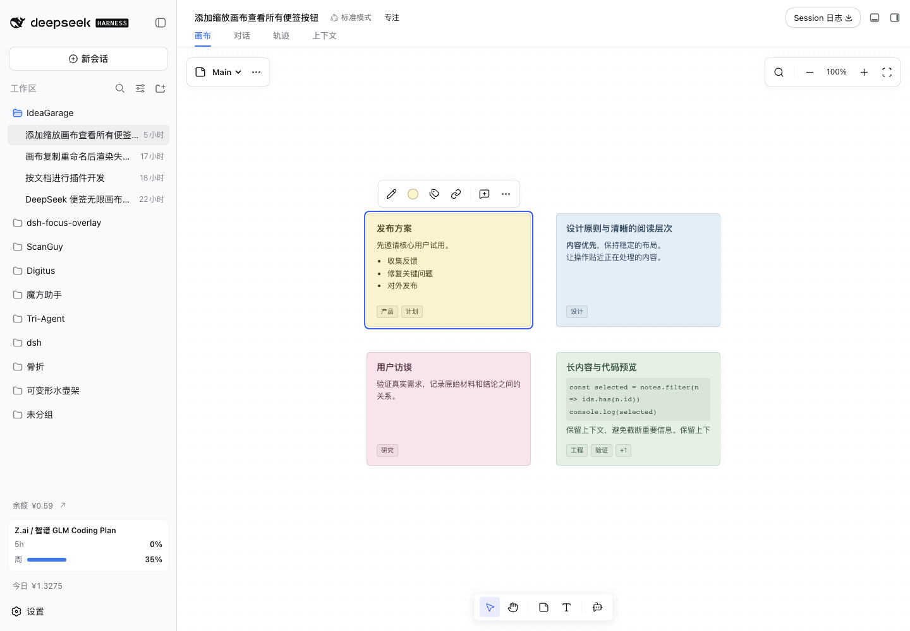
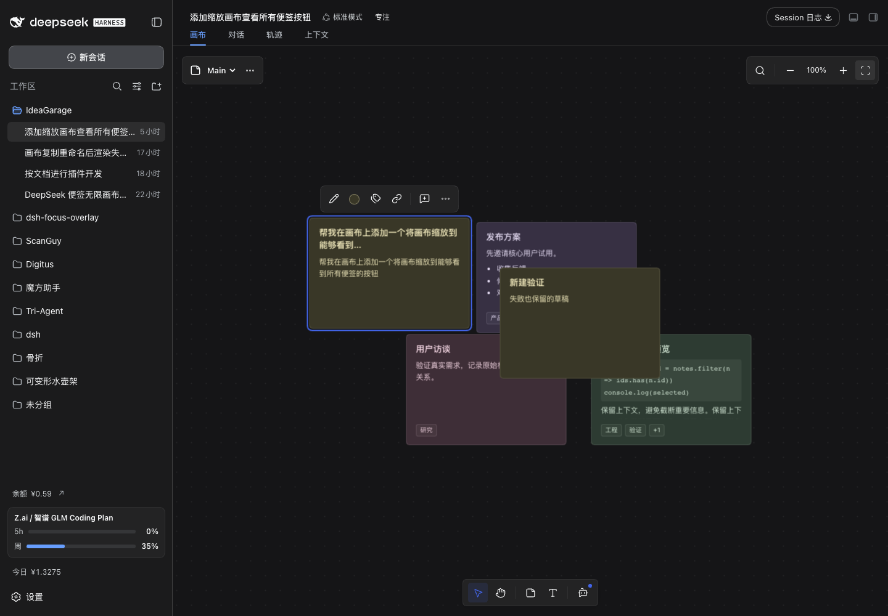
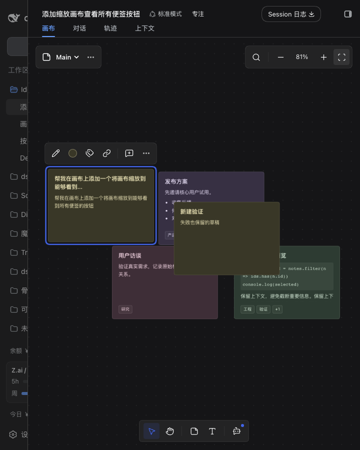

<h1 align="center">dsh-noteboard</h1>

<p align="center">中文 | <a href="README.en.md">English</a></p>

<p align="center">
  为 DeepSeek Harness（DSH）Web GUI 提供的<b>便签画布</b>：一块工作区级的无限画布，便签是纯 Markdown 文件、画布是 JSON Canvas 布局文件——内容与摆放彻底分离，人和 Git 都能直接读写。<br>
  在对话里框选一段话就能存进画布；10 个 AI 工具与 4 个内置工作流让模型直接查询、整理、综合你的便签。
</p>

<p align="center">
  
  
  
</p>

## 功能

- **无限画布** —— 平移、缩放（0.2×–3×，以光标为中心）、点阵网格、空白拖拽框选与整组拖动、网格吸附
- **Markdown 便签** —— 便签是带 YAML frontmatter 的普通 `.md` 文件，七色色板、亮暗双主题；从画布「移除」只删布局节点，不删文件
- **多画布** —— 同一批便签可出现在多个画布的不同位置；「另存为新画布」仅快照布局，不复制文件
- **标签与重排** —— 卡片上增删标签、点标签胶囊聚焦过滤；按标签自动重排（聚簇 + 货架式装箱），重排前自动备份、可一键恢复
- **搜索与便签库** —— 顶部集中搜索标题 / 正文 / 标签；离板便签库找回不在当前画布的便签
- **自由文本与分类标题** —— 画布内自由文本可编辑、移动、复制；自动分类标题可修改、抑制与重新生成
- **对话采集** —— 对话区框选文字：「存入画布」原文入库（不经模型），或「AI 提炼」由 Host 直调 LLM 生成标题、标签与正文（不经对话流，失败可降级为原文存入）
- **来源回链** —— 便签记录 sessionId 与可读 label，可跳回对话定位高亮原文，再返回画布
- **便签引用发送** —— 双态底部操作区把便签以结构化引用加入宿主输入框：气泡预览、单张 / 整组移除、发送前累计长度校验（32,000 字符上限）
- **AI 工具与工作流** —— 10 个模型工具（查询 / 创建 / 修改 / 加入移除 / 整理 / 另存 / 历史 / 恢复）与 4 个内置工作流随插件注册
- **历史与恢复** —— 全部写操作记入 `.noteboard/history/`，可查看修改前后全文并恢复，冲突时拒绝覆盖

## 效果

**桌面宽度 · 亮色主题**



**桌面宽度 · 暗色主题**



**窄窗口 · 暗色主题**



## 能力

| 能力 | 说明 |
| --- | --- |
| 画布标签页 | 经 `conversation.view` 注册，与「对话轨迹」等视图并列；画布数据为工作区级，所有会话共享 |
| 视图操作 | 空白拖拽 / 触控板双指平移，Ctrl/⌘+滚轮与捏合缩放（0.2–3×，以光标为中心），点阵网格随缩放淡出，一键全览 |
| 便签卡片 | 固定 260px 宽，受限 Markdown 渲染（关闭原始 HTML），溢出裁切 + 底部渐隐；拖动实时落盘（debounce 合并写），拖动即置顶 |
| 卡片操作条 | 单击卡片弹出：换色、标签增删、编辑、来源回链、从画布移除 |
| 编辑器 | 居中模态，上半编辑 / 下半实时渲染完整 Markdown；保存失败保留草稿并可重试 |
| 批量操作 | 空白框选（Shift 追加）、Shift/Meta/Ctrl 单击切换成员、整组拖动统一吸附、批量颜色与标签、对齐分布 |
| 自动重排 | 按标签聚簇 + ⌈√n⌉ 自适应网格 + 货架式装箱；重排前备份为 `.backup.json`，可恢复；仅重排所选便签时不改动标题 |
| 自由文本 | 只属于当前画布，不生成文件；14/20/28px 字号与主题颜色，支持混合选择、对齐分布；复制偏移 24px |
| 分类标题 | 自动生成、可编辑；手动修改转为自由文本并记录抑制，重新生成清除抑制并完整重排 |
| 双态操作区 | 底部居中工具态（选择 / 平移 / 新建便签 / 新建文本 / AI 助手）⇄ 输入态（最宽 560px）；切换不改变画布相机 |
| 结构化引用 | 便签以引用气泡加入宿主输入框外侧；点击名称预览、叉号移除；按 ID 去重；发送时重新读取正文，失效引用可移除 |
| 回复通知 | 订阅宿主 Chat 轮次数据，画布激活期间成功完成的回复轻提示（最多三行，12 秒消失，悬停暂停），可跳回对话 |
| 对话采集 | `shell.overlay` 框选浮层：「存入画布」直接原文入库；「AI 提炼」Host 直调 `llm` Service，一次调用生成标题 / 标签 / 正文，失败降级为原文存入 |
| 来源回链 | frontmatter 恒存可读 label，`sessionId` 可解析时显示「打开对话」；按会话 / 对话视图 / 历史加载 / 折叠展开 / 匹配选区定位，区分完整、部分与无法唯一定位 |
| 历史与恢复 | `.noteboard/history/` 记录每次写操作；列出操作记录、查看文件修改前后全文、恢复指定操作并检测后续冲突 |
| 数据兼容 | YAML Document 保留嵌套来源、未知字段与注释；画布保留外部顶层字段（含 `edges`/`groups`）；版本为内容 SHA256；旧 RPC 入口允许无版本调用 |
| 视口记忆 | 视口按工作区与画布记忆；空画布显示引导文案与快捷按钮 |

## 安装

需要 `dsh` CLI（`>= 0.1.2-rc.1`），Node `>= 22.19.0`。

**从 GitHub（当前）**

```sh
dsh plugin --profile web add github:boogoo619/dsh-noteboard
dsh web
```

> git 安装拉取**源码**并由 `prepare` 脚本现场构建。pnpm ≥10 会先拒绝运行 `prepare`，首次 `add` 失败后，按 `dsh` 提示把包键复制进该 profile 的 `pnpm-workspace.yaml`：
>
> ```yaml
> allowBuilds:
>   dsh-noteboard: true
> ```
>
> 然后重新执行 `add`。**该授权允许本包代码在安装时于你的机器上执行**——请只对可信来源授权，并锁定 commit（`github:boogoo619/dsh-noteboard#<sha>`）。

**从 npm（包发布后可用）**

```sh
dsh plugin --profile web add dsh-noteboard
dsh web
```

> 如果 `add` 装到的不是最新版本：这是 pnpm 的 `minimumReleaseAge`（最小发布年龄）安全机制在起作用——默认 **24 小时**内不会把刚发布的版本当作 `latest` 解析，而是回退到上一个稳定版。想立即装最新版，显式指定版本号即可：
>
> ```sh
> dsh plugin --profile web add dsh-noteboard@<版本号>
> ```

本地开发使用 link：

```sh
dsh plugin --profile web add link:/absolute/path/to/dsh-noteboard
```

安装后重启 `dsh web` 生效。

## 使用

1. 打开任意会话，顶部切换到**「便签画布」**标签：整个工作区共享同一批便签，当前激活的画布在此呈现。
2. 双击空白新建便签；单击卡片操作：换色、标签、编辑（实时 Markdown 预览）、来源回链、从画布移除。
3. 在对话里选中一段文字，浮出「存入画布」或「AI 提炼」；新便签带来源回链，点击「打开对话」可跳回原文位置高亮，再返回画布。
4. 点击卡片上的标签胶囊聚焦过滤；工具栏一键按标签自动重排（先备份布局，可恢复）。
5. 底部操作区切到输入态，把便签以引用气泡加入宿主输入框，与你的输入一起发送；AI 忙时自动排队。
6. 直接在对话里说「把这些便签按主题整理一下」——模型经 `noteboard_*` 工具与内置工作流读写画布，操作可在画布操作记录中查看差异并恢复。

## AI 工具与工作流

随插件注册 10 个模型工具：

| 工具 | 说明 |
| --- | --- |
| `canvas_add_note` | 创建一张便签放入指定画布，可记录 `derivedFrom` 依据 |
| `noteboard_query` | 搜索工作区便签，或按 ids 读取全文、版本与来源 |
| `noteboard_create` | 批量创建便签（单次最多 200 张） |
| `noteboard_update` | 修改便签（须携带读取时版本）；内容修改影响所有画布 |
| `noteboard_add` | 把已有便签放入指定画布，不复制文件 |
| `noteboard_remove` | 仅从指定画布移除便签，保留文件 |
| `noteboard_layout` | 重排、对齐、分布指定便签（须携带画布版本） |
| `noteboard_save_as` | 另存画布布局 |
| `noteboard_history` | 列出操作记录，可查看文件修改前后全文 |
| `noteboard_restore` | 恢复指定操作，检测后续修改冲突并拒绝覆盖 |

以及 4 个内置工作流（Skill）：

| 工作流 | 说明 |
| --- | --- |
| `noteboard-organize` | 按主题归类、加标签、整理便签布局 |
| `noteboard-compare` | 比较便签中的方案、权衡优缺点、识别分歧 |
| `noteboard-actions` | 把便签中的想法拆解为行动项或实施步骤 |
| `noteboard-synthesize` | 合并重复便签、去重或综合多个结论 |

普通 AI 操作使用会话模型；选文「AI 提炼」的模型在插件设置中单独配置。

## 数据格式

```
<workspace>/.noteboard/
├── meta.json                      # { "activeCanvas": "Main" }
├── canvases/<名称>.canvas         # JSON Canvas 1.0 布局（Obsidian Canvas 兼容）
├── notes/<日期>-<标题>-<短id>.md  # 便签本体：Markdown + YAML frontmatter
└── history/                       # 操作历史（差异与恢复）
```

- 便签 frontmatter：`id`、`title`、`color`、`tags`、`created`、`source`（回链）、`derivedFrom`（综合依据）；未识别字段一律保留
- 画布文件只是布局视图：节点 `id` 与便签 `id` 互为外键，`text` 使用 Obsidian 风格相对引用；其他 JSON Canvas 工具可直接打开
- 内容版本为 SHA256；写入走队列并做冲突检查

## 设置

侧栏「设置 → 插件 → 插件配置」中，展开「便签画布」卡片：

| 选项 | 说明 |
| --- | --- |
| 提炼 Provider | 「AI 提炼」使用的 provider 路由键；留空自动选择第一个可用 provider（默认空） |
| 提炼模型 | 该 provider 下的模型 id；留空选择其第一个模型（默认空） |
| 提炼提示词 | 自定义提炼提示词；留空使用内置提示词（默认空） |

## 开发

```sh
pnpm install
npm test            # vitest：单元 / API 测试
npx tsc --noEmit    # 类型检查
npm run build       # tsdown 构建：Host 服务 + 客户端 bundle → lib/
```

`test/browser-*.mjs` 为浏览器端到端脚本，需要本地运行的真实 Harness 实例（默认 3081–3083 端口），认证状态与日志位于 `/tmp`，截图输出至 `artifacts/`（已 gitignore）。客户端代码修改构建后刷新页面即可，Host 侧修改需重启实例。

## 边界与已知限制

- 不提供连接线（edges）与成组（groups）的 UI，文件格式已为其留位
- 不监听文件变更：切到画布标签或每次 RPC 操作前整体重读
- 单用户假设：无跨进程文件锁、无实时协同
- 底部操作区适配依赖宿主的 DOM 标记与注入接口，宿主升级后需复验，不能仅凭版本号判定兼容
- 画布内不做完整聊天、富文本与通用 Undo/Redo

## 许可

[MIT](./LICENSE)
